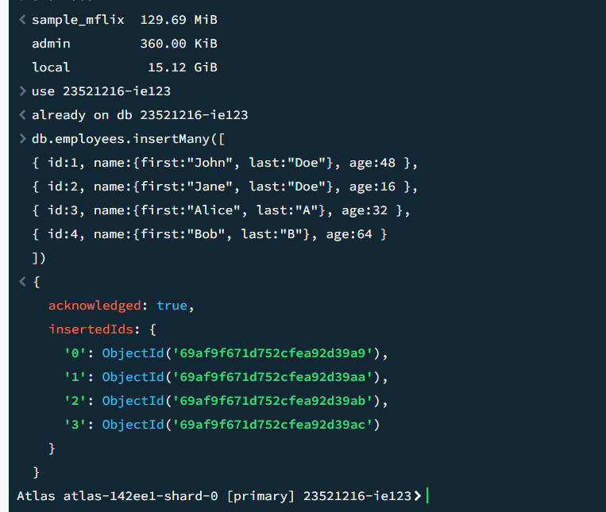
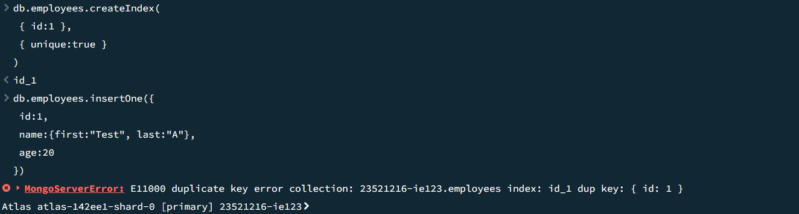
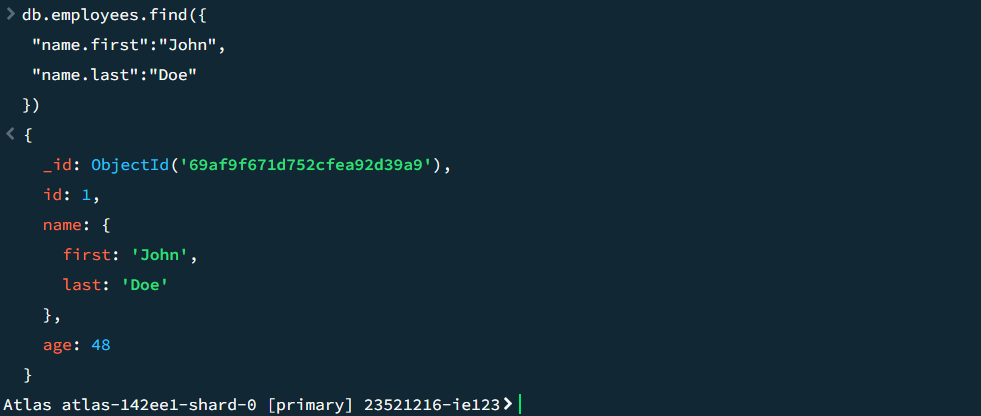
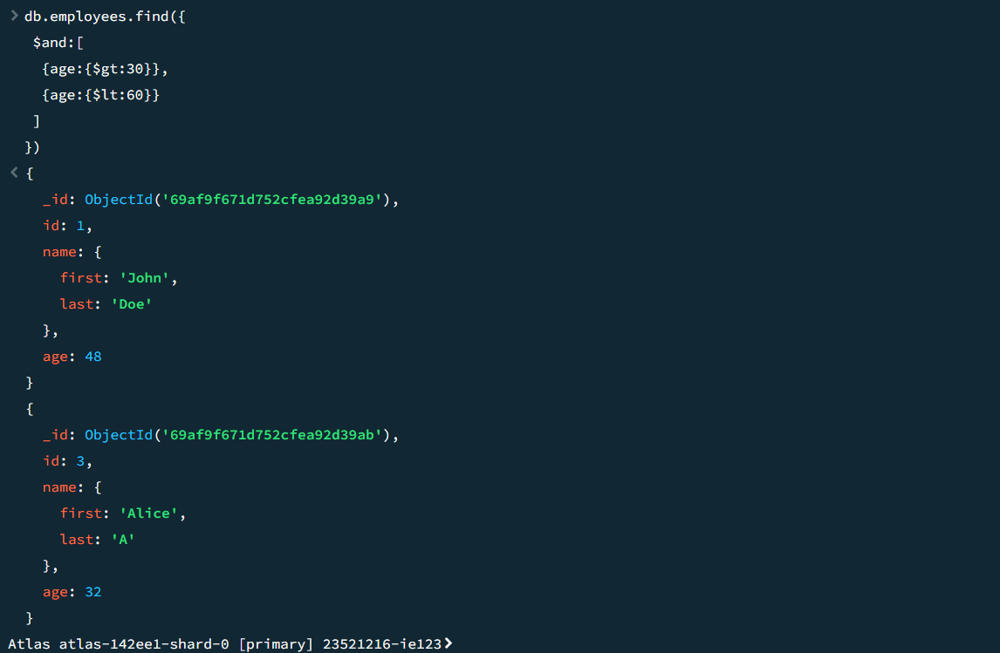
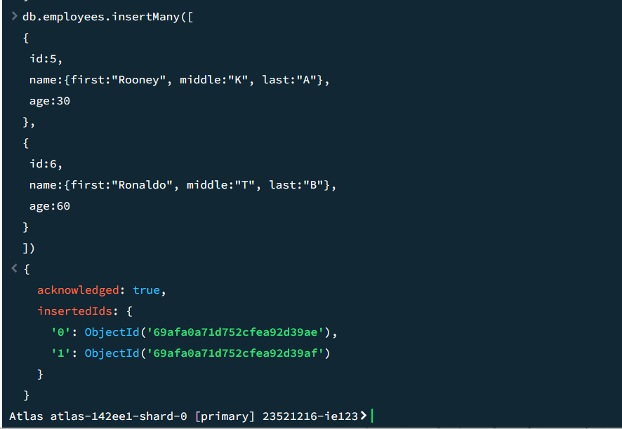
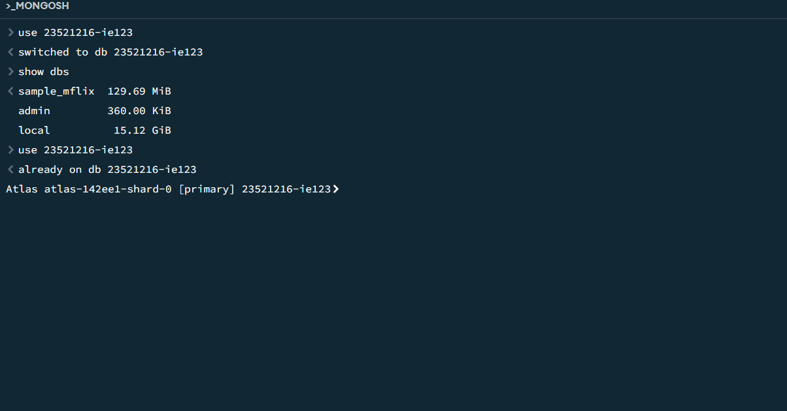
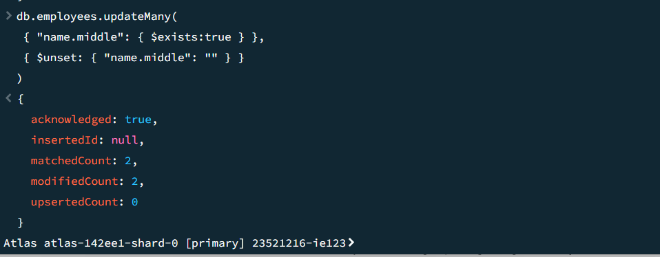
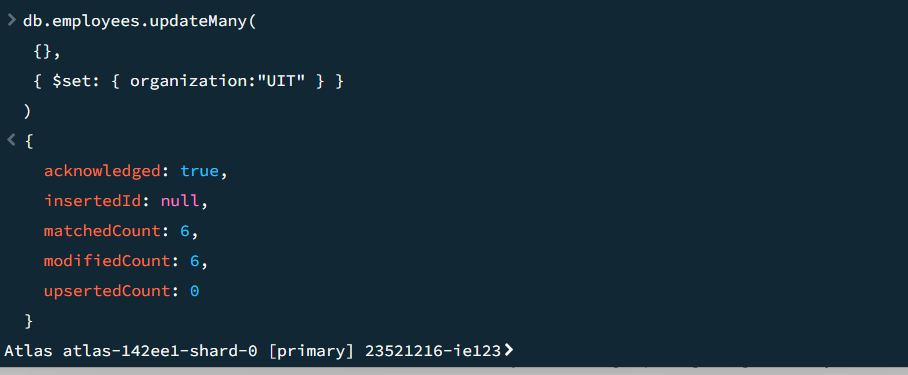
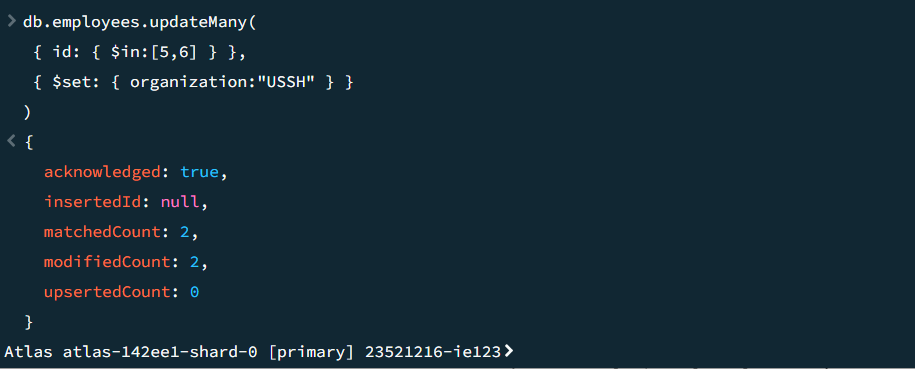
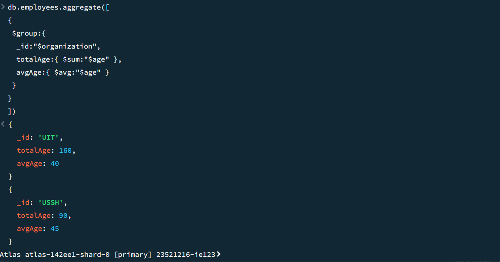

## Mục tiêu bài thực hành

- Kết nối được MongoDB
- Thao tác được với Mongodb shell
- Sử dụng được các câu truy vấn đơn giản

## Công cụ/ môi trường sử dụng
- ChatGPT: giúp viết README và sửa lại các câu truy vấn
- Mongodb shell trong mongodb compass: giúp chạy các câu truy vấn
- webstorm: giúp viết README và push lên git

---
## Lời giải cho các câu bài tập trong lab và hình ảnh kết quả
- 2.2
- db.employees.insertMany([
  {"id":1,"name":{"first":"John","last":"Doe"},"age":48},
  {"id":2,"name":{"first":"Jane","last":"Doe"},"age":16},
  {"id":3,"name":{"first":"Alice","last":"A"},"age":32},
  {"id":4,"name":{"first":"Bob","last":"B"},"age":64}
])
# 
- 2.3
- db.employees.createIndex({id:1},{unique:true})
# 
- 2.4
- db.employees.find({"name.first": "John","name.last":"Doe"})
# 
- 2.5
- db.employees.find({ $and: [{age: { $gt: 30}},{age: { $lt: 60}}]})
# 
- 2.6
- db.employees.insertMany([{"id":5,"name":{"first":"Rooney","middle":"K","last":"A"},"age":30},
  {"id":6,"name":{"first":"Ronaldo","middle":"T","last":"B"},"age":60}])
# 
- db.employees.find({"name.middle":{$exists: true}})
# 
- 2.7
- db.employees.updateMany({"name.middle":{$exists:true}},{$unset:{"name.middle":""}})
# 
- 2.8
- db.employees.updateMany({},{$set:{organization: "UIT"}})
# 
- 2.9
- db.employees.updateMany({id:{$in:[5,6]}},{$set:{organization: "USSH"}})
# 
- 2.10
- db.employees.aggregate([{$match:{organization:{$in: ["UIT", "USSH"]}}},
  {$group:{_id: "$organization", totalAge: { $sum: "$age" }, averageAge: { $avg: "$age" } }}])
# 