## Mục tiêu bài thực hành

- Thiết lập môi trường nodejs
- Tạo dự án backend
- Kết nối tới mongodb
- Viết được 1 api lấy movies

## Công cụ/ môi trường sử dụng

- ChatGPT: giúp sửa lại các syntax của express cũ
- Claude: giúp sửa code
- VisualCodeStudio: giúp viết code

## Cách chạy đồ án

- Đi vào thử mục Lab02 dùng cd Lab02
- Vào tiếp thư mục backend nơi lưu dự án dùng lệnh cd backend
- Chạy với lệnh npm run dev

## Lời giải

## Bài 1

- 1.4 Khởi tạo dự án với câu lệnh npm init.
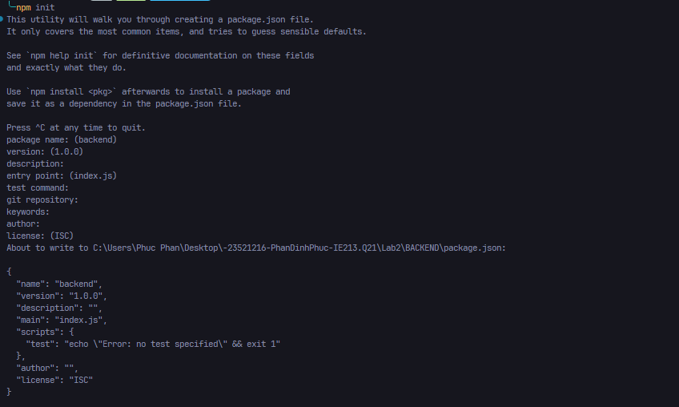

- 1.5 Cài đặt một số dependency của dự án như mongodb, express, cors, dotenv.
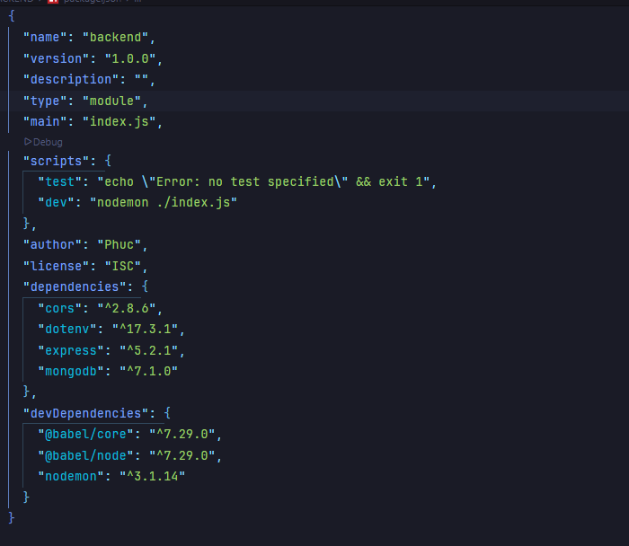

- 1.6 Cài đặt nodemon – công cụ giúp khởi động lại máy chủ web khi có sự thay đổi về mã
nguồn.
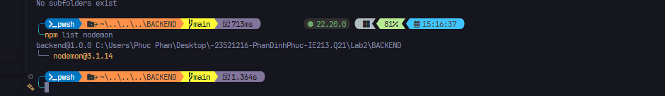

## Bài 2

- 2.1 Tạo tệp tin server.js là nơi khởi tạo máy chủ web
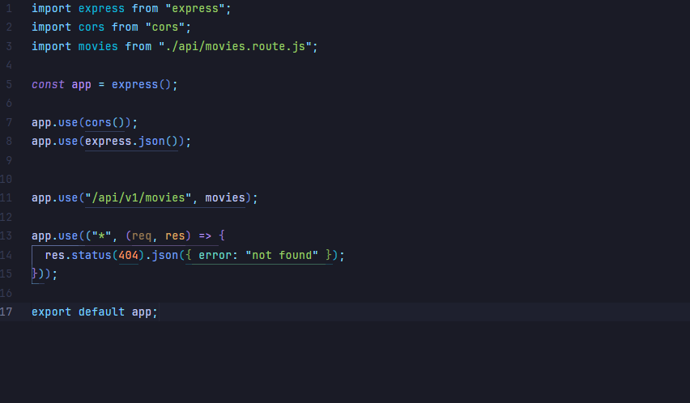

- 2.2 Tạo tệp tin .env để lưu trữ thông tin biến môi trường
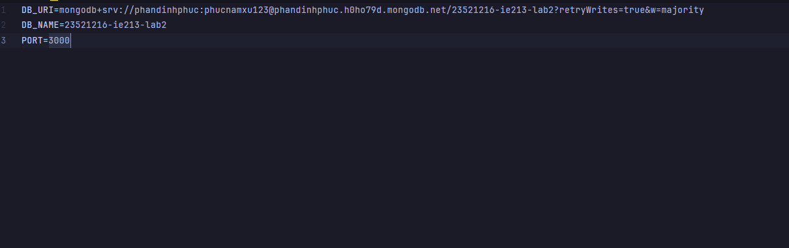

- 2.3 Tạo tệp tin index.js để quản lý việc kết nối dữ liệu, khởi tạo đối tượng, và chạy máy chủ.
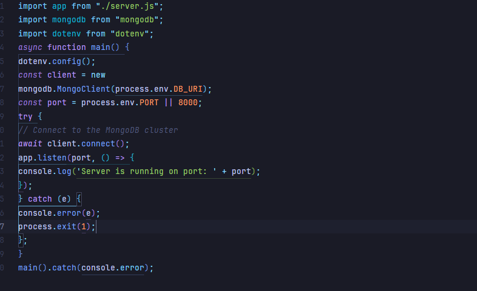

- 2.4 Tạo thư mục và tệp tin tương ứng trong thư mục backend gồm api/movies.route.js để xử lý
các định tuyến liên quan đến ứng dụng minh hoạ movies về sau.
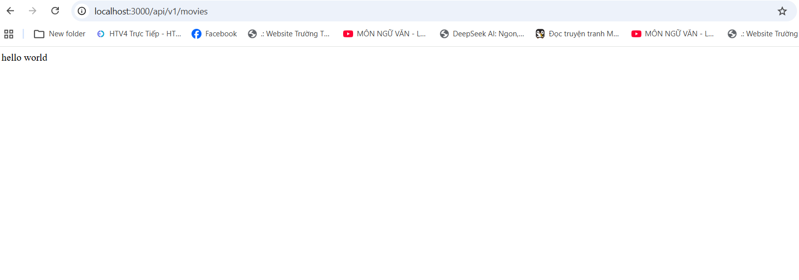
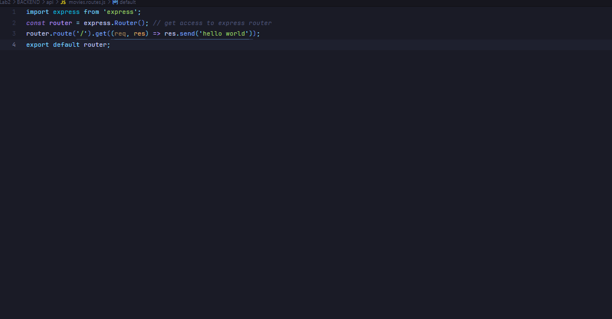

- 2.5 Thiết lập công cụ truy xuất dữ liệu cho ứng dụng Movie với DAO – Data Access Object.
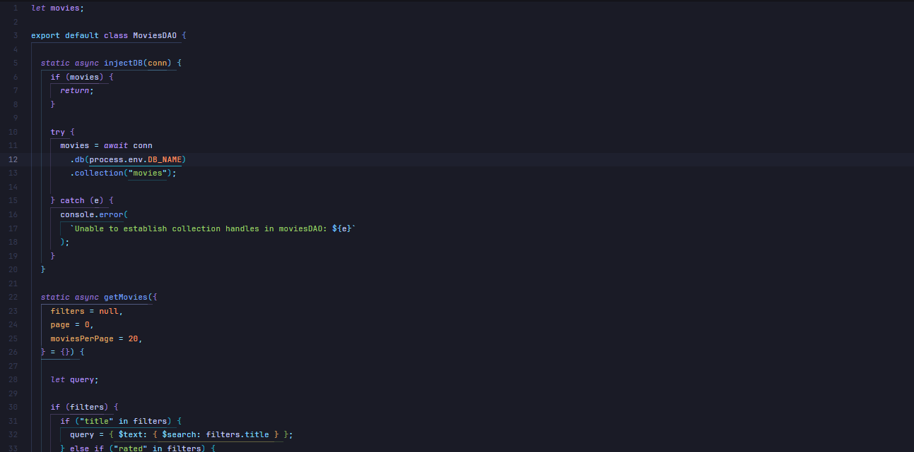
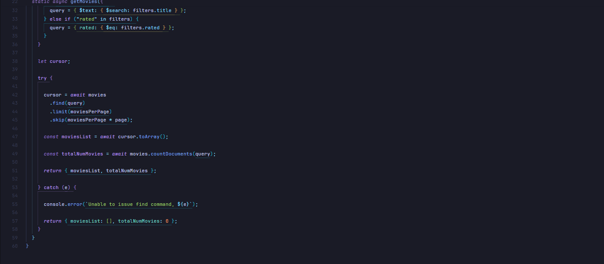

- 2.6 Thiết lập CONTROLLER cho ứng dụng web để gọi tới DAO.
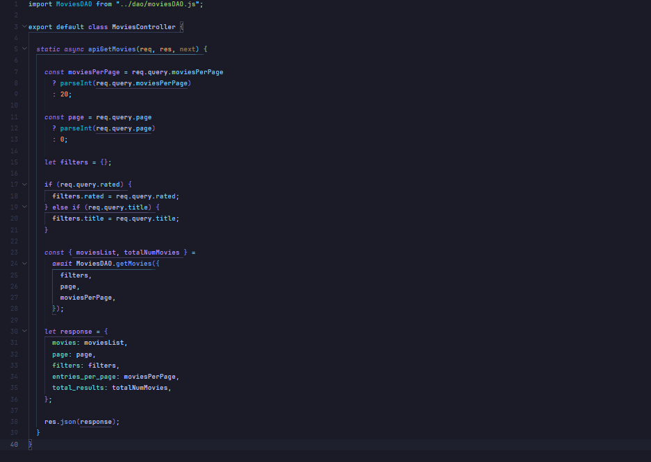
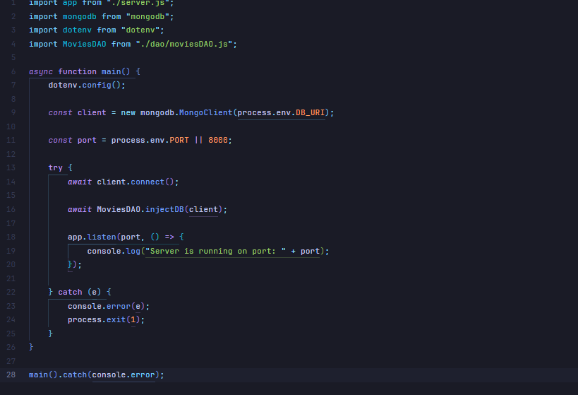

- 2.7 Đưa Controller vừa tạo ở yêu cầu 2.6 vào định tuyến.
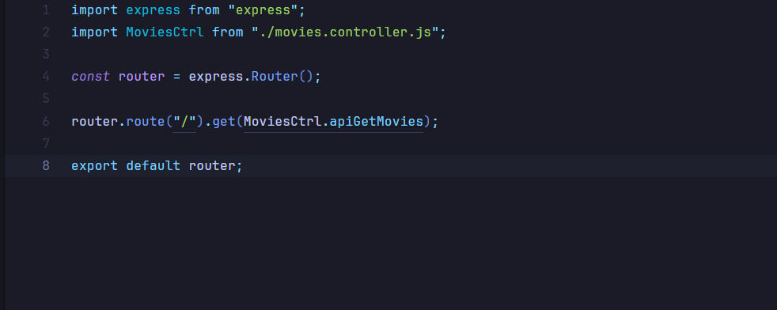
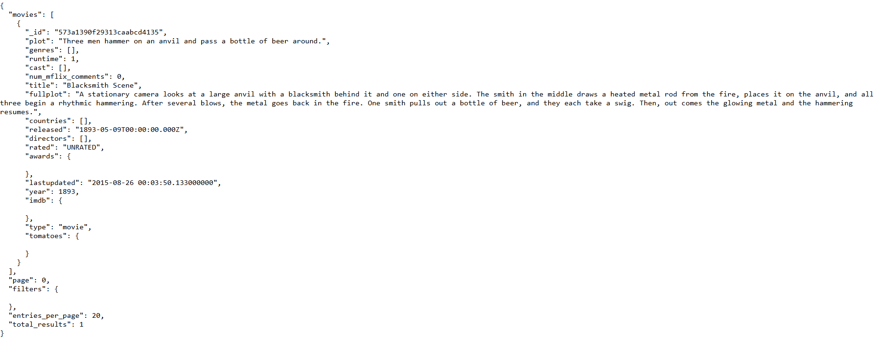
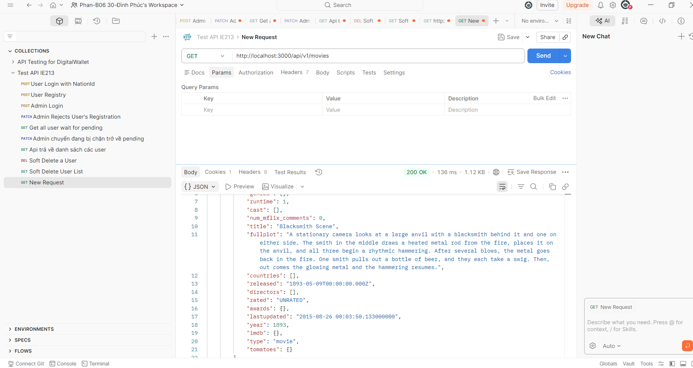
