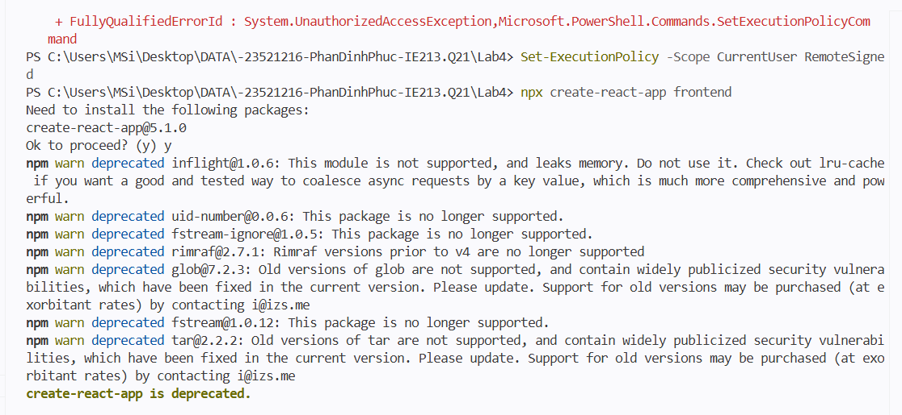
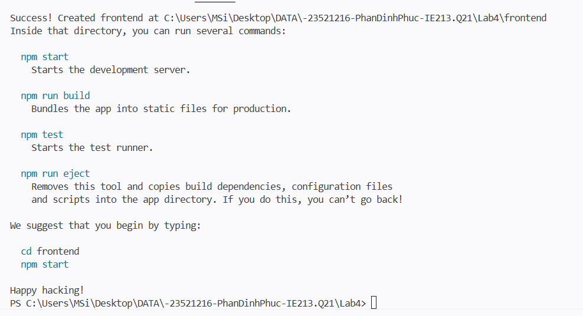
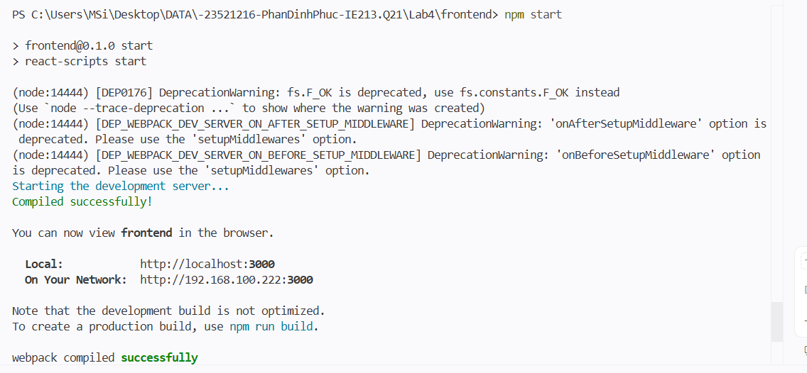
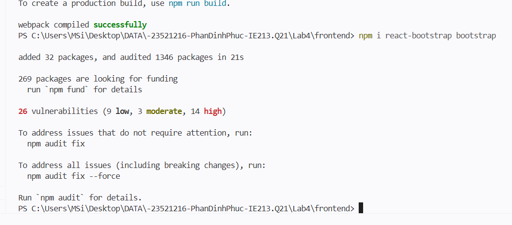
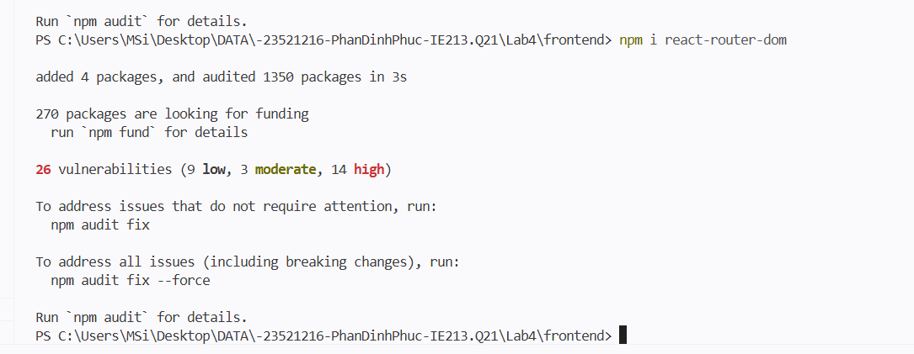
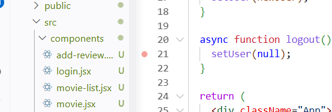
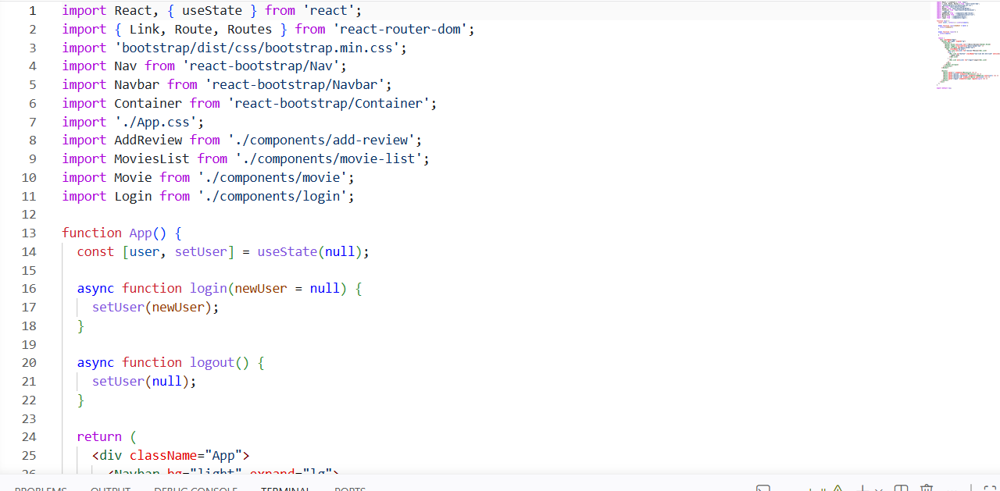
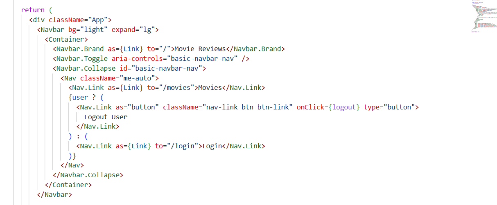
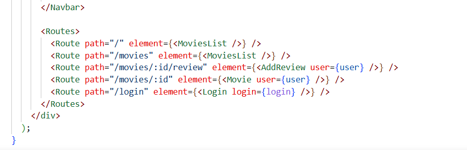

# Lab04 - Thiết lập frontend với ReactJS

## Mục tiêu

- Tạo frontend React cho ứng dụng Movie Review.
- Cài Bootstrap và React Router DOM.
- Xây dựng navbar và định tuyến cho các màn hình chính.

## Công cụ / môi trường

- ReactJS
- React Bootstrap
- React Router DOM
- Node.js / npm

## Cấu trúc chính

- `src/App.js`: navbar, trạng thái đăng nhập, và routes.
- `src/index.js`: bọc ứng dụng bằng `BrowserRouter`.
- `src/components/movie-list.jsx`: trang danh sách phim.
- `src/components/movie.jsx`: trang chi tiết phim.
- `src/components/add-review.jsx`: trang thêm review.
- `src/components/login.jsx`: trang đăng nhập.

## Cách chạy

1. Mở terminal tại thư mục `Lab4/frontend`.
2. Chạy `npm install` nếu chưa cài dependency.
3. Chạy `npm start`.
4. Mở trình duyệt tại địa chỉ `http://localhost:3000`.

## Kết quả đầu ra

- Hiển thị navbar với logo Movie Reviews.
- Có liên kết Movies và trạng thái Login/Logout.
- Điều hướng được giữa các trang `/`, `/movies`, `/movies/:id`, `/movies/:id/review`, và `/login`.
- Build production chạy thành công.
## Phần chính đã thực hiện

- Dùng `useState` để lưu trạng thái người dùng đăng nhập.
- Dùng `Routes` và `Route` để định tuyến các component.
- Dùng `Link` và React Bootstrap để tạo thanh điều hướng.

## Kết quả làm việc
- Bài 1: Thiết lập nơi làm việc với fe
    - 1.1: Khởi tạo template
        - 
        - 
        - 

    - 1.2 Cài đặt bootstrap và router dom
        - 

        - 

- Bài 2: Xây dựng Navigation Header bar cho ứng dụng
    - 2.1 Tạo folder các thành phần của Navbar,
        - 

    - 2.2 Xây dụng các thành phần của Navbar,
        - 
        - 

    - 2.3 Lấy Navbar Component từ React-Bootstrap và thay đổi thông tin
        - 

- Bài 3: Thiết lập các định tuyến cho các component 
    - 

## Kiểm tra kết quả chạy

- `npm run build`: chạy thành công.

## AI hỗ trợ

- Công cụ đã sử dụng: GitHub Copilot.
- Mục đích sử dụng: hỗ trợ ghép đúng cấu trúc React Router và kiểm tra lỗi build.
- Phần được hỗ trợ: khung `App.js`, các component tối thiểu, và mô tả README.
